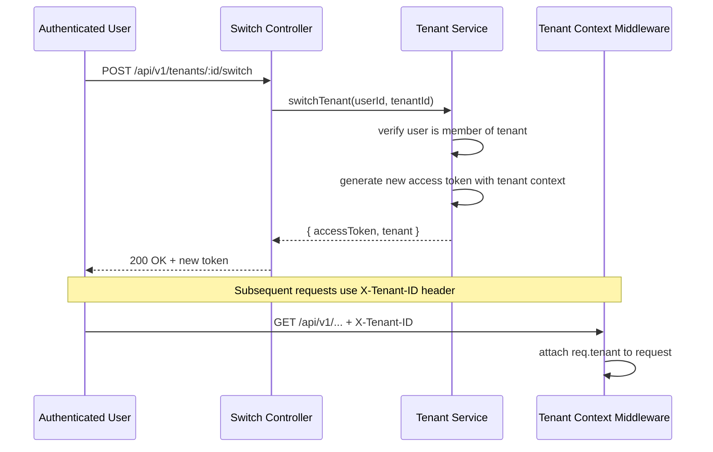
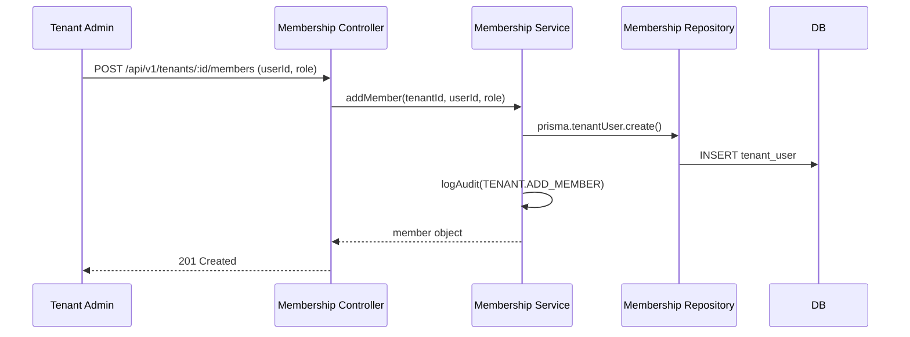
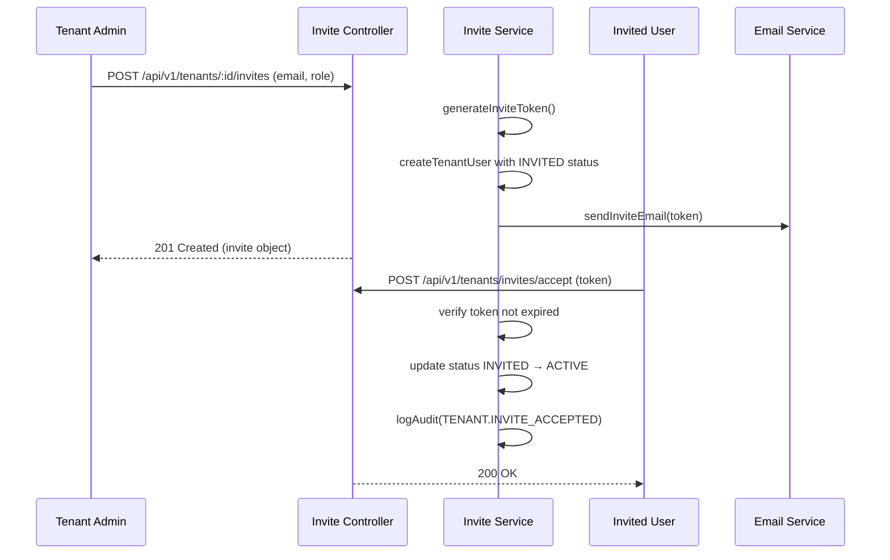

# Tenant Module Architecture - Production-Grade Design

## Step 1: Workspace Analysis Summary

### 1.1 What Already Exists for Tenant Support

| Component | Status | Details |
|-----------|--------|---------|
| **Prisma Models** | ✅ Complete | `Tenant`, `TenantUser`, `TenantOwnership`, `TenantUserPermission` already defined |
| **Tenant Model** | ✅ Complete | id, name, ownerUserId, plan (FREE default), isActive, timestamps, soft delete |
| **TenantUser Model** | ✅ Complete | tenantId, userId, role (ADMIN/MANAGER/USER), status (INVITED/ACTIVE/SUSPENDED/REMOVED), invitedBy |
| **RBAC Tables** | ✅ Complete | `Permission`, `RolePermission`, `TenantUserPermission` - tenant-scoped permissions supported |
| **Audit Logging** | ✅ Complete | `AuditLog` model with tenantId, actorUserId, entityType TENANT |
| **Relations** | ✅ Complete | User → Tenant (ownedTenants), Tenant → AuditLog, User → tenantUserPermissions |

### 1.2 What Is Missing (Needs Implementation)

| Component | Priority | Description |
|-----------|----------|-------------|
| **Tenant Module Structure** | HIGH | Empty `src/modules/tenant/` directory - needs full layered architecture |
| **Tenant CRUD APIs** | HIGH | Create, read, update, delete, list, restore tenant |
| **Tenant Context Middleware** | HIGH | Resolve current tenant from request header/params |
| **Membership APIs** | HIGH | Add/remove/update members, list members |
| **Invite System** | HIGH | Invite users, accept/reject, expiry handling |
| **Tenant Switch API** | HIGH | Switch active tenant context |
| **Tenant Settings** | MEDIUM | Tenant-scoped settings storage |
| **Domain Mapping** | LOW | Custom domain support (optional) |
| **Billing Integration** | LOW | Plan management (optional) |

### 1.3 What Should NOT Be Modified

- **Auth Module** - Fully implemented, do not change
- **Prisma Schema** - Tenant models already exist, only add missing fields if needed
- **Core Utilities** - `ApiError`, `asyncHandler`, `response`, `requestContext`, `logAudit`
- **Existing Middlewares** - Extend rather than modify

---

## Step 2: Tenant Module Folder Structure

Following EXACT pattern from [`src/modules/auth/`](src/modules/auth/) module:

```
src/modules/tenant/
├── controllers/
│   ├── tenant.controller.js        # Tenant CRUD operations
│   ├── tenant-membership.controller.js  # Member management
│   ├── tenant-invite.controller.js      # Invite flow
│   └── tenant-settings.controller.js    # Tenant settings
├── services/
│   ├── tenant.service.js           # Tenant business logic
│   ├── tenant-membership.service.js    # Membership logic
│   ├── tenant-invite.service.js       # Invite logic
│   └── tenant-settings.service.js     # Settings logic
├── repositories/
│   ├── tenant.repository.js        # Tenant DB operations
│   ├── tenant-membership.repository.js # Membership DB ops
│   └── tenant-invite.repository.js    # Invite DB ops
├── routes/
│   ├── tenant.routes.js            # Tenant endpoints
│   ├── tenant-membership.routes.js # Membership endpoints
│   ├── tenant-invite.routes.js     # Invite endpoints
│   └── tenant-settings.routes.js   # Settings endpoints
├── schemas/
│   ├── tenant.schema.js            # Zod validation for tenant
│   ├── tenant-membership.schema.js # Zod validation for membership
│   └── tenant-invite.schema.js     # Zod validation for invite
├── utils/
│   ├── tenant.utils.js             # Tenant-specific utilities
│   └── tenant-context.js           # Tenant context helpers
├── constants/
│   └── tenant.constants.js         # Tenant-related constants
└── middleware/
    └── tenant.middleware.js        # Tenant-specific middleware
```

**Naming Convention**: Use kebab-case (e.g., `tenant-membership.controller.js`) matching auth module pattern.

---

## Step 3: Data Flow Design

### 3.1 Tenant Creation Flow

```mermaid
sequenceDiagram
    participant User as Authenticated User
    participant API as Tenant Controller
    participant Service as Tenant Service
    participant Repository as Tenant Repository
    participant DB as PostgreSQL

    User->>API: POST /api/v1/tenants (name, plan?)
    API->>Service: createTenant({ name, ownerUserId, plan })
    Service->>Repository: prisma.$transaction([
        create tenant,
        create tenantUser (owner),
        create default role mappings
    ])
    Repository->>DB: INSERT queries
    DB-->>Repository: Created tenant
    Service->>Service: logAudit(TENANT.CREATE)
    Service-->>API: tenant object
    API-->>User: 201 Created
```

**Key Points**:
- Owner automatically gets `ADMIN` role
- Default permissions assigned based on role
- Audit log created for tenant creation

### 3.2 Tenant Switching Flow



**Key Points**:
- Tenant ID passed via `X-Tenant-ID` header (not URL)
- Access token optionally regenerated with tenant claim
- Middleware validates membership before proceeding

### 3.3 Membership Flow



**Member Status Transitions**:
```
INVITED → ACTIVE (when user accepts invite)
ACTIVE → SUSPENDED (admin action)
ACTIVE → REMOVED (admin action)
ANY → REMOVED (user leaves)
```

### 3.4 Invite Flow



**Invite Expiry**: 7 days default (configurable)

---

## Step 4: Middleware Requirements

### 4.1 Tenant Context Resolver Middleware

**File**: `src/modules/tenant/middleware/tenant.middleware.js`

```javascript
// Extract and validate tenant from request
export const resolveTenant = asyncHandler(async (req, res, next) => {
    const tenantId = req.headers['x-tenant-id'];
    
    if (!tenantId) {
        // Allow if endpoint doesn't require tenant context
        return next();
    }
    
    // Verify tenant exists and is active
    const tenant = await findActiveTenantById(tenantId);
    if (!tenant) {
        throw new ApiError(404, "Tenant not found");
    }
    
    req.tenant = tenant;
    req.tenantId = tenant.id;
    next();
});
```

### 4.2 Tenant Permission Middleware

**File**: `src/modules/tenant/middleware/tenant-permission.middleware.js`

```javascript
// Combine with existing RBAC
export const requireTenantPermission = (permission) => {
    return asyncHandler(async (req, res, next) => {
        const { userId, tenantId } = req;
        
        if (!tenantId) {
            throw new ApiError(400, "Tenant context required");
        }
        
        const hasPermission = await checkTenantPermission(userId, tenantId, permission);
        if (!hasPermission) {
            throw new ApiError(403, "Insufficient tenant permissions");
        }
        
        next();
    });
};
```

### 4.3 Middleware Integration

| Middleware | Purpose | Where to Apply |
|------------|---------|----------------|
| `resolveTenant` | Attach tenant to request | Global (after auth) |
| `requireTenantPermission` | Check tenant-level permissions | Route-level |
| `requireTenantOwner` | Only owner can delete tenant | Specific routes |

---

## Step 5: Complete Tenant API Design

### 5.1 Tenant Lifecycle APIs

| Method | Route | Purpose | Permission | Service File |
|--------|-------|---------|------------|--------------|
| POST | `/api/v1/tenants` | Create new tenant | Authenticated | `tenant.service.js` |
| GET | `/api/v1/tenants/:id` | Get tenant details | Member | `tenant.service.js` |
| PATCH | `/api/v1/tenants/:id` | Update tenant | Admin | `tenant.service.js` |
| DELETE | `/api/v1/tenants/:id` | Soft delete tenant | Owner | `tenant.service.js` |
| POST | `/api/v1/tenants/:id/restore` | Restore tenant | Owner | `tenant.service.js` |
| GET | `/api/v1/tenants` | List my tenants | Authenticated | `tenant.service.js` |

### 5.2 Tenant Membership APIs

| Method | Route | Purpose | Permission | Service File |
|--------|-------|---------|------------|--------------|
| POST | `/api/v1/tenants/:id/members` | Add member | Admin | `tenant-membership.service.js` |
| DELETE | `/api/v1/tenants/:id/members/:userId` | Remove member | Admin | `tenant-membership.service.js` |
| PATCH | `/api/v1/tenants/:id/members/:userId` | Update member role | Admin | `tenant-membership.service.js` |
| GET | `/api/v1/tenants/:id/members` | List members | Member | `tenant-membership.service.js` |
| GET | `/api/v1/tenants/my` | Get user's tenants | Authenticated | `tenant-membership.service.js` |
| POST | `/api/v1/tenants/:id/members/:userId/suspend` | Suspend member | Admin | `tenant-membership.service.js` |

### 5.3 Tenant Invite Flow APIs

| Method | Route | Purpose | Permission | Service File |
|--------|-------|---------|------------|--------------|
| POST | `/api/v1/tenants/:id/invites` | Invite user | Admin | `tenant-invite.service.js` |
| GET | `/api/v1/tenants/:id/invites` | List invites | Admin | `tenant-invite.service.js` |
| POST | `/api/v1/tenants/invites/accept` | Accept invite | Invited User | `tenant-invite.service.js` |
| POST | `/api/v1/tenants/invites/reject` | Reject invite | Invited User | `tenant-invite.service.js` |
| POST | `/api/v1/tenants/invites/:id/resend` | Resend invite | Admin | `tenant-invite.service.js` |
| DELETE | `/api/v1/tenants/invites/:id` | Cancel invite | Admin | `tenant-invite.service.js` |

### 5.4 Tenant Settings APIs

| Method | Route | Purpose | Permission | Service File |
|--------|-------|---------|------------|--------------|
| GET | `/api/v1/tenants/:id/settings` | Get settings | Admin | `tenant-settings.service.js` |
| PATCH | `/api/v1/tenants/:id/settings` | Update settings | Admin | `tenant-settings.service.js` |

### 5.5 Tenant Switching API

| Method | Route | Purpose | Permission | Service File |
|--------|-------|---------|------------|--------------|
| POST | `/api/v1/tenants/:id/switch` | Switch active tenant | Member | `tenant.service.js` |

### 5.6 Tenant Domain APIs (Optional)

| Method | Route | Purpose | Permission | Service File |
|--------|-------|---------|------------|--------------|
| POST | `/api/v1/tenants/:id/domain` | Set domain | Owner | `tenant.service.js` |
| GET | `/api/v1/tenants/:id/domain/verify` | Verify domain | Owner | `tenant.service.js` |

### 5.7 Tenant Subscription APIs (Optional)

| Method | Route | Purpose | Permission | Service File |
|--------|-------|---------|------------|--------------|
| GET | `/api/v1/tenants/:id/subscription` | Get plan | Owner | `tenant.service.js` |
| PATCH | `/api/v1/tenants/:id/subscription` | Update plan | Owner | `tenant.service.js` |

---

## Step 6: Implementation Roadmap

### Phase 1: Foundation (Priority: HIGH)

**Step 1.1**: Create folder structure
- Create `src/modules/tenant/` with all subdirectories
- Copy patterns from auth module

**Step 1.2**: Create constants
- `src/modules/tenant/constants/tenant.constants.js`

**Step 1.3**: Create schemas (Zod)
- `tenant.schema.js` - createTenant, updateTenant, tenantParams
- `tenant-membership.schema.js` - addMember, updateMember

**Step 1.4**: Create repositories
- `tenant.repository.js` - CRUD operations
- `tenant-membership.repository.js` - member operations

**Step 1.5**: Create services
- `tenant.service.js` - business logic
- `tenant-membership.service.js` - membership logic

**Step 1.6**: Create controllers
- `tenant.controller.js`
- `tenant-membership.controller.js`

**Step 1.7**: Create routes and register in app.js
- `tenant.routes.js`
- `tenant-membership.routes.js`

**Step 1.8**: Create middleware
- `tenant.middleware.js` - resolveTenant

### Phase 2: Invite System (Priority: HIGH)

**Step 2.1**: Create invite schemas
- `tenant-invite.schema.js`

**Step 2.2**: Create invite repository
- `tenant-invite.repository.js`

**Step 2.3**: Create invite service
- `tenant-invite.service.js`

**Step 2.4**: Create invite controller
- `tenant-invite.controller.js`

**Step 2.5**: Create invite routes
- `tenant-invite.routes.js`

### Phase 3: Settings & Advanced (Priority: MEDIUM)

**Step 3.1**: Create settings schema
**Step 3.2**: Create settings service
**Step 3.3**: Create settings controller/routes

### Phase 4: Domain & Billing (Priority: LOW - Optional)

**Step 4.1**: Domain verification logic
**Step 4.2**: Subscription management (integrate with payment provider)

---

## Step 7: Code Organization Summary

### File-to-File Mapping

| Layer | Auth Reference | Tenant Implementation |
|-------|-----------------|------------------------|
| Schema | `auth.schema.js` | `tenant.schema.js` |
| Repository | `auth.repository.js` | `tenant.repository.js` |
| Service | `login.service.js` | `tenant.service.js` |
| Controller | `login.controller.js` | `tenant.controller.js` |
| Routes | `auth.routes.js` | `tenant.routes.js` |
| Constants | `auth.constants.js` | `tenant.constants.js` |

### Reused Components

All these existing utilities MUST be reused:

- [`ApiError`](src/utils/api-error.js) - Error handling
- [`asyncHandler`](src/utils/async-handler.js) - Route wrapper
- [`successResponse`](src/utils/response.js) - JSON responses
- [`logAudit`](src/lib/audit.logger.js) - Audit logging
- [`requestSchema`](src/schemas/request.schema.js) - Zod wrapper
- [`validate`](src/middlewares/validate.middleware.js) - Schema validation
- [`requireAccessToken`](src/middlewares/auth.middleware.js) - Auth check
- Prisma instance from [`src/lib/prisma.js`](src/lib/prisma.js)

---

## Next Steps

After this architecture is approved:

1. Switch to **Code mode**
2. Execute Phase 1 implementation in order
3. Test each endpoint before moving to next phase

The architecture follows clean architecture principles with clear separation of concerns:
- **Controllers** handle HTTP concerns
- **Services** contain business logic
- **Repositories** handle database operations
- **Schemas** handle validation
- **Middleware** handles cross-cutting concerns
